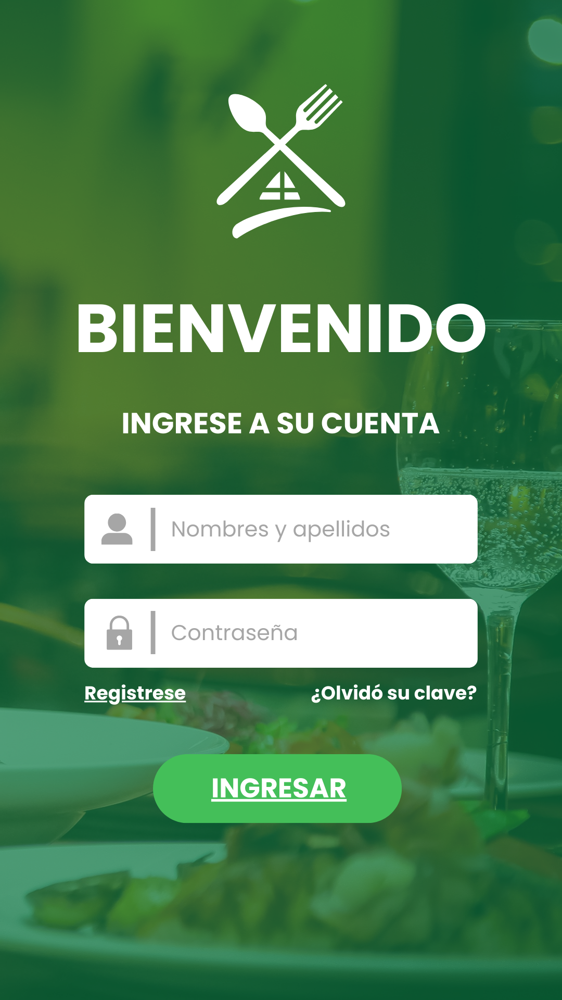
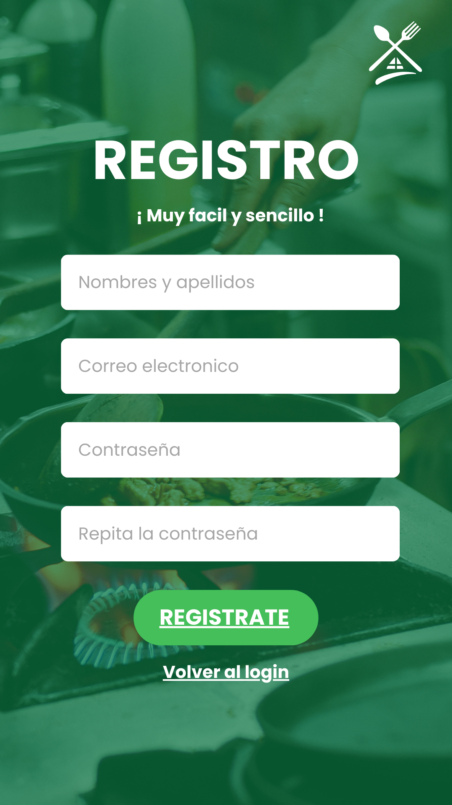
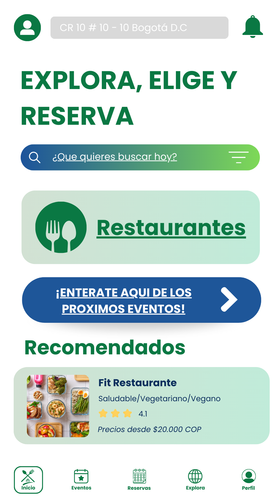
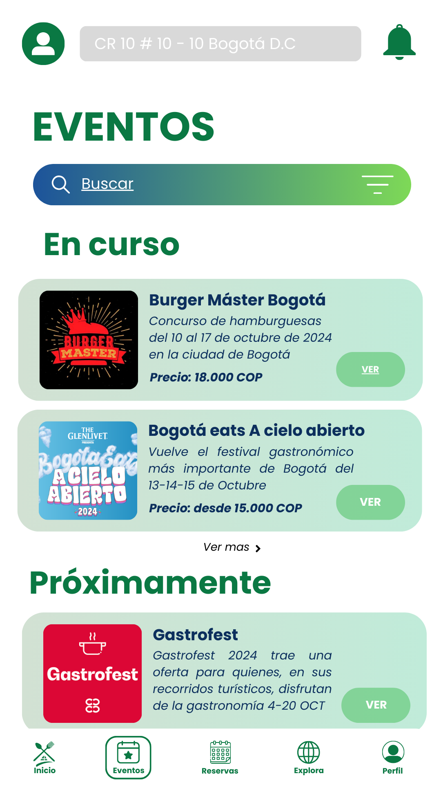
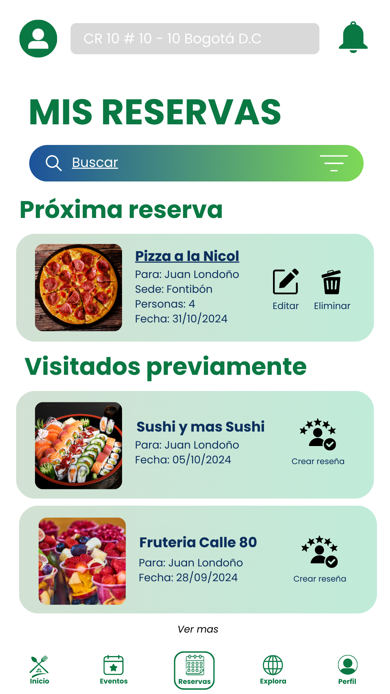
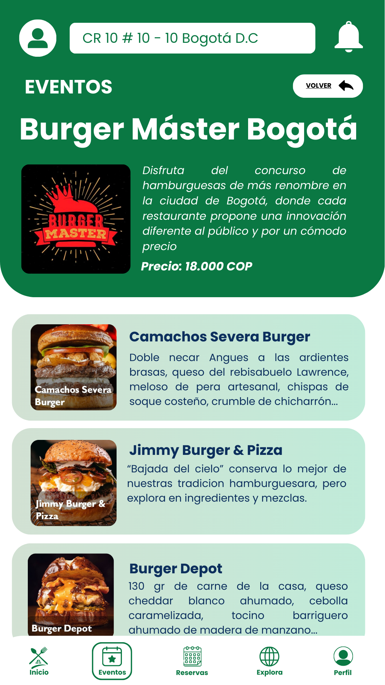
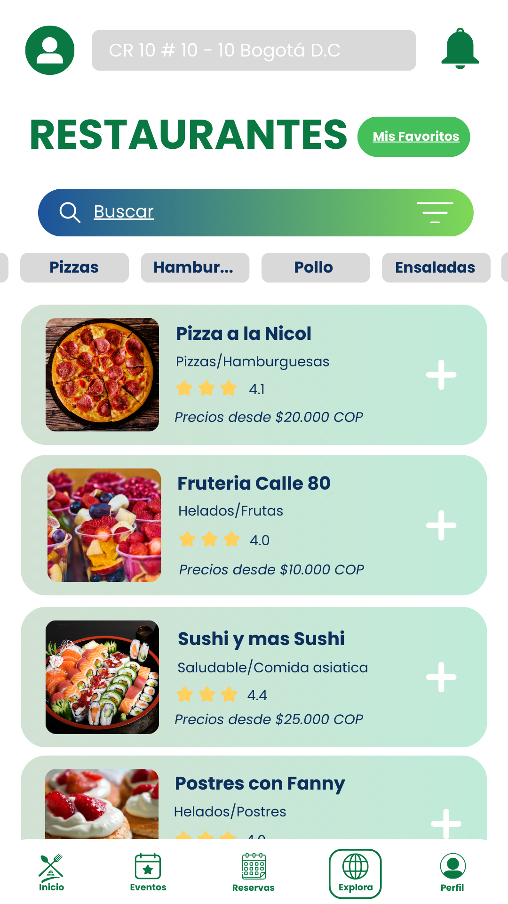
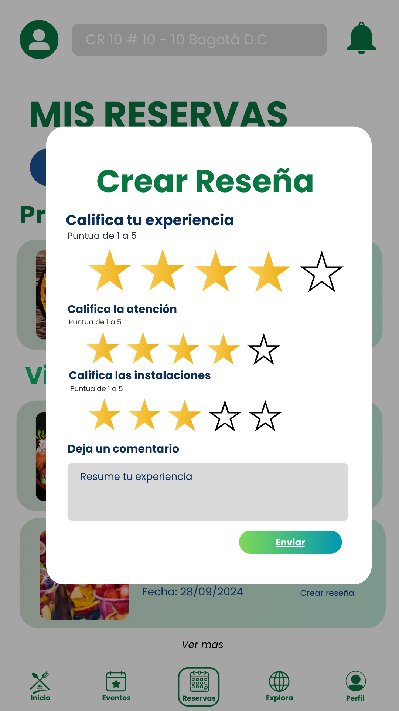

# Diseño de interfaz de usuario

La aplicación tendrá la siguientes pantallas

1. Pantalla 1: Login

2. Pantalla 2: Signup

3. Pantalla 3: Inicio

4. Pantalla 4: Eventos

5. Pantalla 5: Reservas Propias

6. Pantalla 6: Explora

7. Pantalla 7: Perfil Usuario

8. Pantalla 8: Perfil Restaurante

9. Pantalla 9: Evento especifico

10. Pantalla 10: Restaurantes

11. Pantalla 11: Formulario Reserva

12. Pantalla 12: Calificación

# Referencias

- [Material Design: Foundations](https://m3.material.io/foundations)
- [Material Design: Style](https://m3.material.io/styles)
